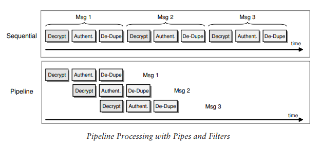

# Assignment 7: EIP Reading Task {ignore=true}

[Assignment description](https://datsoftlyngby.github.io/soft2020fall/resources/0dc4c4f6-A7-EIP.pdf)

The following glossary is created by using definitions found in: [Enterprise Integration Patterns by Gregor Hohpe and Bobby Woolf.](https://www.enterpriseintegrationpatterns.com/docs/EnterpriseIntegrationPatterns_HohpeWoolf_ch03.pdf)

## Table of contents {ignore=true}

[TOC]

## Message

A message is an atomic packet of data that can be transmitted on a channel. A message consits of two parts:

1. _Header_
   Information that describes the data being transmitted, its origin, its destination etc.
2. _Body_  
   The data which is being transmitted.

## Message Channels

A messaging application transmits data through a Message Channel, which is a virtual pipe that connects a sender to a receiver. You as a developer must determine how your applications need to communicate and then create the channels to facilitate it.  
 The application should have different channels for different types of information.

## Transformation / Message Translator

Different applications may not use the same format for data. Therefore a message must be transformed from one format to another.  
 _Different kinds of translators:_

## Pipes and Filters

If a message needs to be authenticated or transformed, you need to chain multiple processings steps together using channels. _Pipes and Filters_ describes a fundamental architectural style for messaging systems: Individual processing steps (**filters**) are chained together through the messaging channels (**pipes**).  
 
<em>[source](https://www.enterpriseintegrationpatterns.com/docs/EnterpriseIntegrationPatterns_HohpeWoolf_ch03.pdf#page=15)</em>

## Pipeline Processing

Connecting components with asynchronous Message Channels allows each unit in the chain to operate in its own thread or its own process. When a unit has completed processing one message, it can send the message to the output channel and immediately start processing another message.  
 

## Parallel Processing

With _Pipeline Processing_ you are limited by the slowest process in the chain. You can deploy multiple parallel instances of that process. You need to be aware that with this method, messages can be processed out of order.  
 

## Message Route

A message may have to go through several channels to reach its final destination. The sender might not know which channel that will be the final receiver, so it sends its message to a router, which takes the place of a filter in the Pipes and Filters architecture. The router then directs the message to the final receiver or at least to the next router.  
 The Message Router differs from the basic notion of Pipes and Filters in
that it connects to multiple output channels (i.e., it has more than one output
port)  
 

## Message Endpoints

A Message Endpoint is either used to send messages or receive them, but one instance does not do both. An endpoint is channel-specific, so a single application would use multiple endpoints to interface with multiple channels. The Message Endpoint code.  
 

## Publish–Subscribe Pattern

Publish-subscribe pattern is a messaging pattern, where the senders of the message (**publisher**), do not program the messages to be sent directly to specific receivers (**subscribers**), but instead categorize published messages into classes.  
 In a **topic-based** system, messages are published to "topics" or named logical channels. Subscribers in a topic-based system will receive all messages published to the topics to which they subscribe. The publisher is responsible for defining the topics to which subscribers can subscribe.  
 In a **content-based** system, messages are only delivered to a subscriber if the attributes or content of those messages matches constraints defined by the subscriber. The subscriber is responsible for classifying the messages.[^1]
[^1]: https://en.wikipedia.org/wiki/Publish–subscribe_pattern

## Message Oriented Middleware

Message Oriented Middleware (**MOM**) is a concept, where you pass data between applications using a coommuncation channel that carries messages. Messages are usually sent and received asynchroonously. [^2]
[^2]: https://www.oreilly.com/library/view/enterprise-service-bus/0596006756/ch05.html

_Middleware categories:_

- Remote Procedure call (RPC)
- Object Request Broker (ORB)
